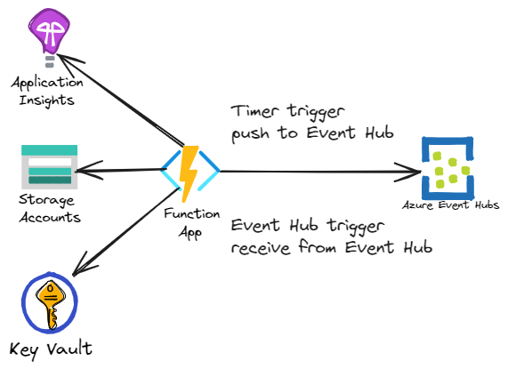

# Azure Function with Event Hub with Virtual Network features

## Azure Developer CLI (AZD) enabled

This AZD template will deploy the following resources:

- Virtual network with two subnets (optional)
- Azure Function Premium plan
  - Optional support for virtual network integration
- Azure Function app
  - Optional support for virtual network private endpoint
- Application Insights
- Log Analytics workspace
- Key Vault
  - Optional support for virtual network private endpoint
  - Azure Storage connection string is set as a Key Vault secret
- Event Hub namespace and event hub
  - Optional support for virtual network private endpoint
- Storage account
  - Optional support for virtual network private endpoint

The function app will be configured to use managed identity to connect to the Event Hub, Key Vault, and Azure Storage resources.  The Azure Storage connection string for `WEBSITE_CONTENTAZUREFILECONNECTIONSTRING` is placed within the provisioned Key Vault resource.

> NOTE: [Azure Files does not support use of managed identity when accessing the file share](https://learn.microsoft.com/azure/azure-functions/functions-reference?tabs=blob&pivots=programming-language-csharp#configure-an-identity-based-connection).  As such, the Azure Storage connection string for `WEBSITE_CONTENTAZUREFILECONNECTIONSTRING` is stored in Azure Key Vault.

## High-level architecture

The diagram below depicts the high-level resource architecture when no virtual network is used.  This may be suitable for local development when it is suitable to push the Function application code from a development workstation or CI/CD pipeline/workflow without a virtual network connected build agent.



Alternatively, the Azure resources can be configured to use virtual network integration  and private endpoints by setting the `USE_VIRTUAL_NETWORK_INTEGRATION` and 'USE_VIRTUAL_NETWORK_PRIVATE_ENDPOINT' environment settings to `true`.  Doing so will result in high-level architecture depicted below.


## Getting started

1. Create two AZD environments - one for local dev (no vnets) and one for working with vnets.
1. Add the following settings to your AZD environment for working with vnets.  Change the virtual network address space as desired.

    ```shell
    USE_VIRTUAL_NETWORK_INTEGRATION="true"
    USE_VIRTUAL_NETWORK_PRIVATE_ENDPOINT="true"
    VIRTUAL_NETWORK_ADDRESS_SPACE_PREFIX="10.1.0.0/16"
    VIRTUAL_NETWORK_INTEGRATION_SUBNET_ADDRESS_SPACE_PREFIX="10.1.1.0/24"
    VIRTUAL_NETWORK_PRIVATE_ENDPOINT_SUBNET_ADDRESS_SPACE_PREFIX="10.1.2.0/24"
    ```

1. Add the following settings to your AZD environment for local development (no vnets):

    ```shell
    USE_VIRTUAL_NETWORK_INTEGRATION="false"
    USE_VIRTUAL_NETWORK_PRIVATE_ENDPOINT="false"
    ```

1. For working locally (no vnets), use the `azd up` command to provision the Azure resources and deploy the Azure Function code.  The Azure Function is a simple function which sends an event to the provisioned Event Hub every 5 minutes.
1. When using vnets and `USE_VIRTUAL_NETWORK_PRIVATE_ENDPOINT="true"`, use the `azd provision` command to provision the Azure resources.  You will not be able to deploy application code due to the private endpoint on the Azure Function.  Deployment will need to be done from an agent connected to the virtual network.
